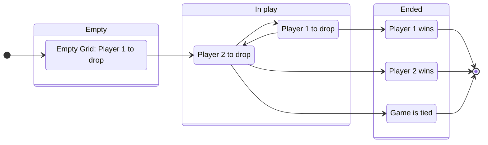

# Connect 4
## Language of the game
### From the rule sheet
* Grid - 7 slots of 6 spaces
* Discs - Coloured for each player
* Slot - where players drop their disks
* Slider bar, legs – not key to gameplay or used in a digital version.
### Additional terminology
* Space, Column - discs dropped into a slot take up spaces in a column

## Rules
* **On your turn, drop one of your discs into any slot in the top of the grid.**
    * The grid has seven slots a player can place a disc in. ^19885d
    * Each slot has spaces to hold six discs.
    * Discs fall (by gravity) to the first free space on top of the previously placed discs in the slot.
    * The grid starts empty for a new game.
* **Take turns …**
    * On Player 1's turn, after they ply, it becomes Player 2's turn.
    * On Player 2's turn, after they ply, it becomes Player 1's turn.
* **… until one player gets 4 of their colour discs in a row. The first player to get 4-in-a-row wins!**
    * Horizontally
    * Vertically
    * Diagonally (positive)
    * Diagonally (negative)
    * The game ends in a tie if the grid is full with no 4s-in-a-row.
    * A run of more than 4 in-a-row is a win.
    * Multiple 4s-in-a-row for a player is a win.

Additionally, “**The youngest player goes first!**”, we're not going to include that in our abstraction.

## Abstraction
We can ignore that the game comes with 2 legs, a slider bar, and specifically 21 red discs, 21 yellow discs. The colours red and yellow don't matter, just that they are different.

Let's use an example grid,
```
🟦 🟦 🟦 🟦 🟦 🟦 🟦
🟦 🟦 🟦 🟦 🟦 🟦 🟦
🟦 🟦 🟦 🟦 🟦 🟦 🟦
🟦 🟦 🟦 🟦 🟦 🟦 🟦
🟦 🟦 🔴 🔴 🟦 🟦 🟦
🟦 🟡 🔴 🟡 🟡 🟦 🟦
 0  1  2  3  4  5  6
```

### List of moves
We can store, in order, where each player dropped their disc, alternating player 1 and 2. e.g.,
```javascript
const game = [3, 3, 1, 2, 4, 2];
```
Valid games arrays contain only the numbers 0, 1, 2, 3, 4, 5, 6 no more than six times each with a length no longer than 42 (6 × 7). Valid games also have at most one player winning.

**Pros:** Matches the moves players make.
**Cons:** Difficult to determine whether the game is won.

### Grid array
We can match the grid structure as a 2D Array, with 0 representing an empty space, 1 for player 1's disc, and 2 for player 2.
```javascript
const game = [
    [0, 0, 0, 0, 0, 0, 0],
    [0, 0, 0, 0, 0, 0, 0],
    [0, 0, 0, 0, 0, 0, 0],
    [0, 0, 0, 0, 0, 0, 0],
    [0, 0, 2, 2, 0, 0, 0],
    [0, 1, 2, 1, 1, 0, 0]
]
```

**Pros:** Matches how the game is displayed.
**Cons:** Slots (columns) are over multiple array elements.

### List of slots
The same as above, but transposed. Since slots are the key game concept, let's arrange our data to match that.
```javascript
const game = [
    [0, 0, 0, 0, 0, 0],
    [1, 0, 0, 0, 0, 0],
    [2, 2, 0, 0, 0, 0],
    [1, 2, 0, 0, 0, 0],
    [1, 0, 0, 0, 0, 0],
    [0, 0, 0, 0, 0, 0],
    [0, 0, 0, 0, 0, 0]
]
```

**Pros:** Each slot is independent of the others.
**Cons:** Need to transpose back to display.

Or the same with only discs not empty spaces,
```javascript
const game = [[], [1], [2, 2], [1, 2], [1], [], []]
```

**Pros:** Dropping a disc is a push operation.
**Cons:** Comparing rows of discs is more difficult.

### String representation
We could indeed store the game as it's string display representation, complete with emoji!
```javascript
const game = (
`🟦 🟦 🟦 🟦 🟦 🟦 🟦
🟦 🟦 🟦 🟦 🟦 🟦 🟦
🟦 🟦 🟦 🟦 🟦 🟦 🟦
🟦 🟦 🟦 🟦 🟦 🟦 🟦
🟦 🟦 🔴 🔴 🟦 🟦 🟦
🟦 🟡 🔴 🟡 🟡 🟦 🟦`
);
```

**Pros:** Console display is trivial!
**Cons:** Everything!

## Operations

Drop a disc into a slot (Player 1 or Player 2). The simplest form of this is,
```javascript
const game_next_step = drop(3, game);
```
```
🟦 🟦 🟦 🟦 🟦 🟦 🟦
🟦 🟦 🟦 🟦 🟦 🟦 🟦
🟦 🟦 🟦 🟦 🟦 🟦 🟦
🟦 🟦 🟦 🟡 🟦 🟦 🟦
🟦 🟦 🔴 🔴 🟦 🟦 🟦
🟦 🟡 🔴 🟡 🟡 🟦 🟦
 0  1  2  3  4  5  6
```
where the first argument is which slot the disc is being dropped into.
In principle, numbering the columns starting at zero is a computing detail rather than how players of the game refer to the columns. There's a lot to be gained from zero-based indexing, but you can put these in game terms too - the slots are referred to by letter - this may be overkill.
```javascript
const slot_A = 0;
const slot_B = 1;
const slot_C = 2;
const slot_D = 3;
const slot_E = 4;
const slot_F = 5;
const slot_G = 6;
const game_next_step = drop(slot_D, game);
```
```
🟦 🟦 🟦 🟦 🟦 🟦 🟦
🟦 🟦 🟦 🟦 🟦 🟦 🟦
🟦 🟦 🟦 🟦 🟦 🟦 🟦
🟦 🟦 🟦 🟡 🟦 🟦 🟦
🟦 🟦 🔴 🔴 🟦 🟦 🟦
🟦 🟡 🔴 🟡 🟡 🟦 🟦
 A  B  C  D  E  F  G
```
An extension of this is to explicitly pass the colour of the disc being dropped.
```javascript
const yellow = 1;
const red = 2;
const game_next_step = drop(yellow, slot_D, game);
```
```
🟦 🟦 🟦 🟦 🟦 🟦 🟦
🟦 🟦 🟦 🟦 🟦 🟦 🟦
🟦 🟦 🟦 🟦 🟦 🟦 🟦
🟦 🟦 🟦 🟡 🟦 🟦 🟦
🟦 🟦 🔴 🔴 🟦 🟦 🟦
🟦 🟡 🔴 🟡 🟡 🟦 🟦
 A  B  C  D  E  F  G
```
Not strictly needed for the original game, but allows extensions where there are different types of disc to drop.
Perhaps a matter of taste the order of arguments, think of partial application, options are,
* Drop a disc
* Drop a yellow disc
* Drop a yellow disc into slot D
* Drop a yellow disc into slot D in this game
As always, data last.

Remember the signature of the function is agnostic to the data abstraction.
The implementation changes based on the abstraction chosen.
Here is a set of example implementations, (without the checks for legal moves)

**List of moves**
```javascript
const drop = (slot_index, game) => game.concat(slot_index);
```

**List of Slots, no empty spaces**
```javascript
const drop = function (slot_index, game) {
    const disc = next_disc_to_drop(game);
    const slot = game[slot_index];
    return game.with(slot_index, slot.concat(disc));
};
```

**List of Slots, with empty spaces**
```javascript
const drop_in_slot = (disc, slot) => R.pipe(
    remove_empty_spaces,
    R.append(disc),
    pad_empty_spaces
)(slot);

const drop = function (slot_index, game) {
    const disc = next_disc_to_drop(game);
    const slot = game[slot_index];
    return game.with(slot_index, drop_in_slot(disc, slot));
};
```

**Grid Array**
```javascript
const drop_in_slot = (disc, slot) => R.pipe(
    remove_empty_spaces,
    R.append(disc),
    pad_empty_spaces
)(slot);

const drop_transposed = function (slot_index, grid) {
    const disc = next_disc_to_drop(grid);
    const slot = grid[slot_index];
    return grid.with(slot_index, drop_in_slot(disc, slot));
};

const drop = (slot_index) => R.pipe(
    R.transpose,
    (grid) => drop_transposed(slot_index, grid),
    R.transpose
);
```

The list of moves is clearly the easiest to drop a disc into and the grid array most involved. One of the list of slots has the balance of making moves and checking for 4-in-a-row easier.

## Finite State Machine

